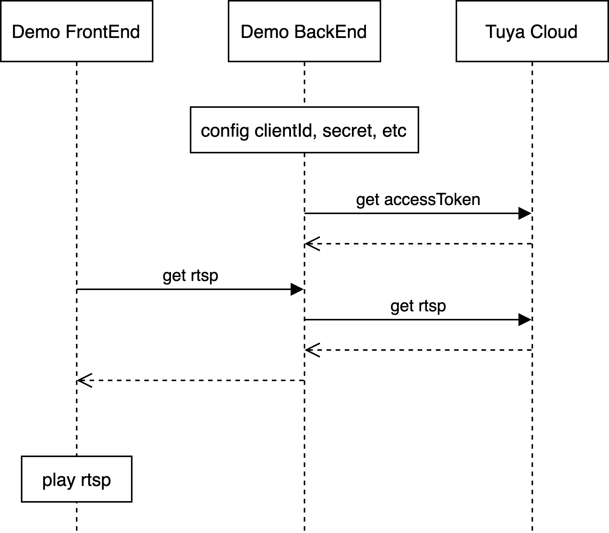

# Tuya RTSP Web Sample接入文档

## 模块组成
### Web前端
* 提供用于Chrome访问URL获取RTSP播放地址的页面

### Web后端
* 托管Web页面
* 访问涂鸦云，通过HTTP协议获取需要的各种配置信息
* 访问涂鸦云，通过HTTP协议请求RTSP播放地址

### 涂鸦云
* 提供开放平台各种HTTP接口

## Step By Step
1. 注册[Tuya开放平台](https://docs.tuya.com/zh/iot/open-api/quick-start/quick-start1)，获取`clientId`和`secret`

2. 更新Sample webrtc.json中的`clientId`和`secret`

3. 认证模式分为easy简单模式和auth授权码模式
    * easy，填写uId到webrtc.json
    * auth，访问[Tuya开放平台授权](https://openapi.tuyacn.com/selectAuth?client_id={clientId}&redirect_uri=https://www.example.com/auth&state=1234)，输入涂鸦账号和密码，同意授权，截取浏览器回调URL中的授权码`code`，填写到webrtc.json

4. 涂鸦智能APP中选中一台IPC，查询设备ID，更新到Sample webrtc.json的`deviceId`

5. 在Sample源码路径，执行`go get`后执行`go build`

6. 运行`./webrtc-demo-go`

7. Chrome打开`http://localhost:3333/api/stream/rtsp`，获取的响应为RTSP播放地址

8. 30秒内在命令行执行`ffplay -i 'rtsps://******'`播放RTSP实时流

## ffplay下载
### Windows
* 下载`https://www.gyan.dev/ffmpeg/builds/ffmpeg-release-essentials.7z`

### Mac
* 下载`https://evermeet.cx/ffmpeg/ffplay-4.3.1.7z`，